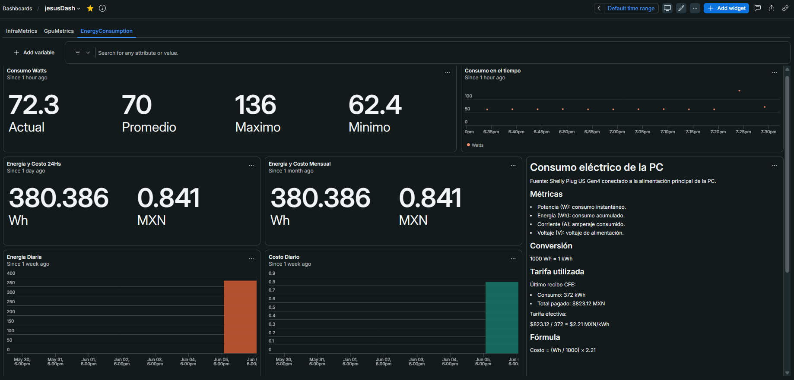

# energyConsumptionPc

Script para monitorizar el consumo eléctrico de una PC usando un enchufe inteligente Shelly y enviarlo a New Relic.

## Funcionamiento
1. **Recolección:** Consulta la API local del dispositivo Shelly (`/rpc/Shelly.GetStatus`).
2. **Métricas:** Extrae datos eléctricos (`apower`, `voltage`, `current`, `energyTotal` en Wh).
3. **Exportación:** Envía los datos como evento (`metricsConsumptionPc`) a la API de New Relic.

## Cálculo de Costo (CFE)
Datos base del último recibo eléctrico:
- **Consumo:** 372 kWh
- **Total pagado:** $823.12 MXN
- **Tarifa efectiva:** $823.12 / 372 = **$2.21 MXN/kWh**

### Fórmula de Costo
Como el Shelly reporta la energía en Watts-hora (Wh), la conversión a costo es:

```text
Costo = (Wh / 1000) × 2.21
```

## Dashboard


Visualización en New Relic de las métricas recolectadas. Muestra:
- Potencia actual, promedios y picos (W).
- Energía acumulada (Wh) y costo estimado (MXN) en períodos de 24h y mensual.
- Gráficas de tendencia y consumo acumulado diario.
